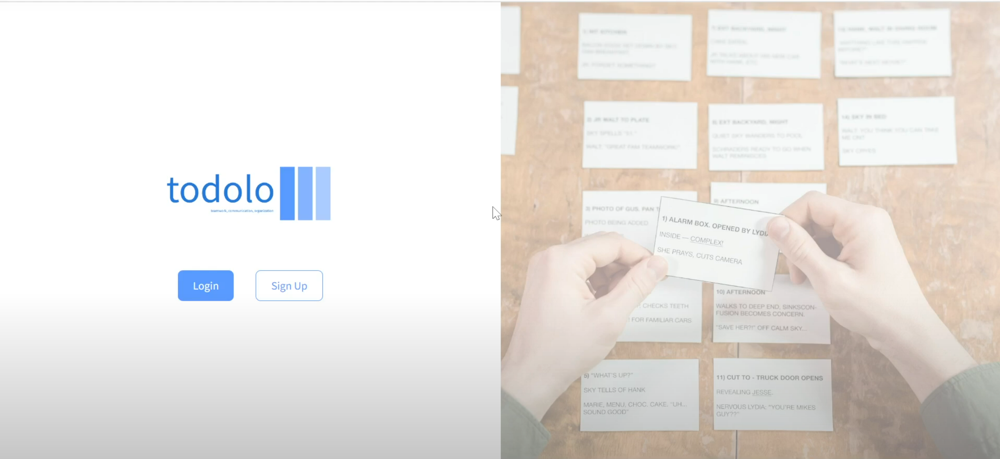
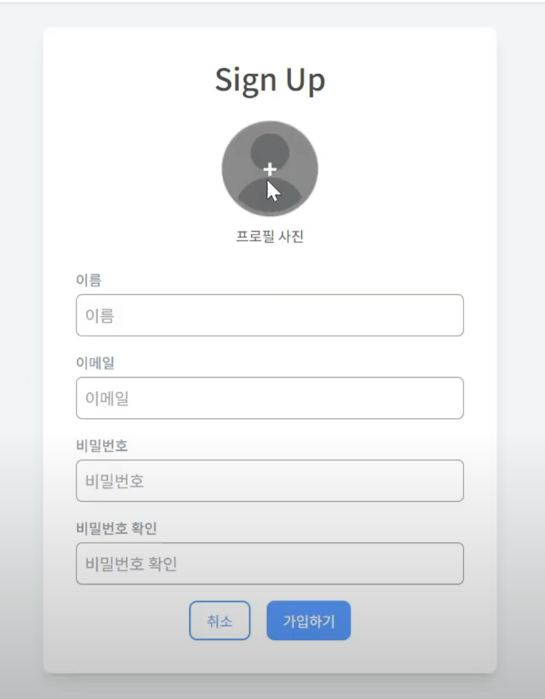
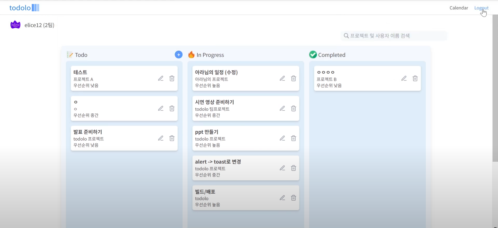
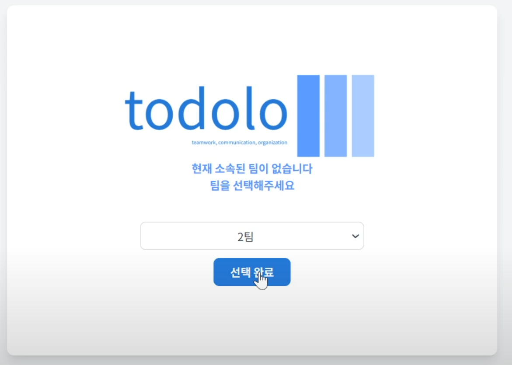
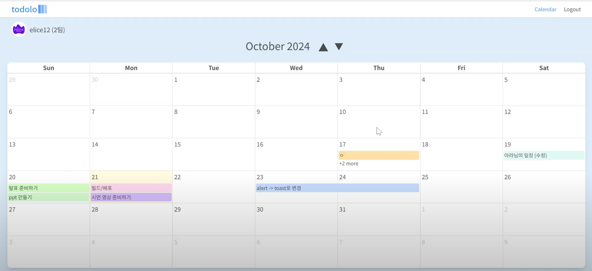
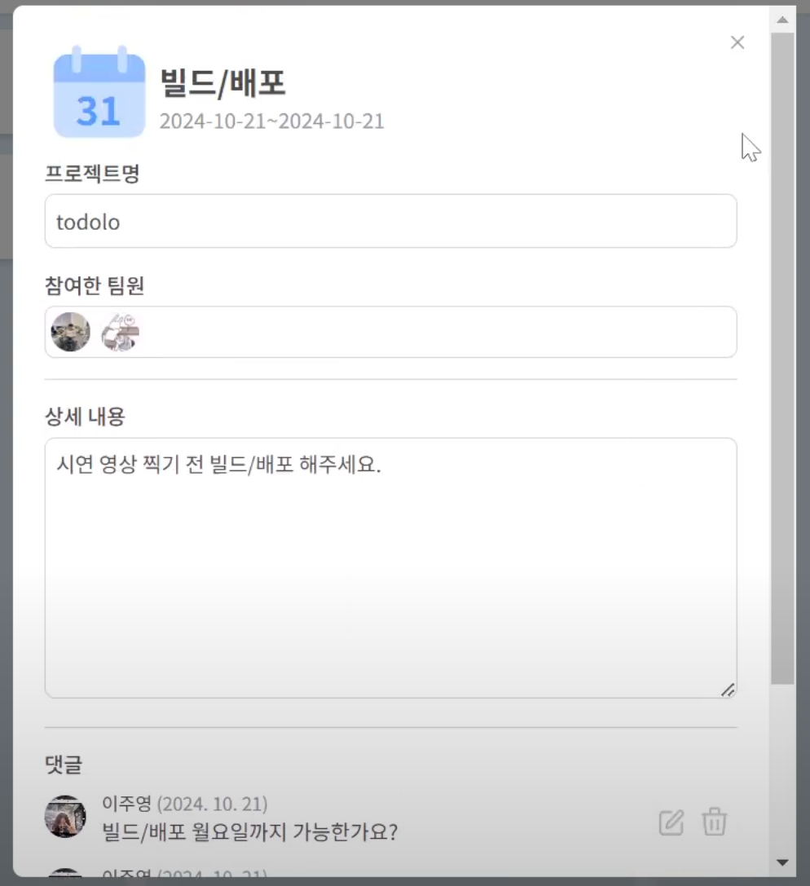
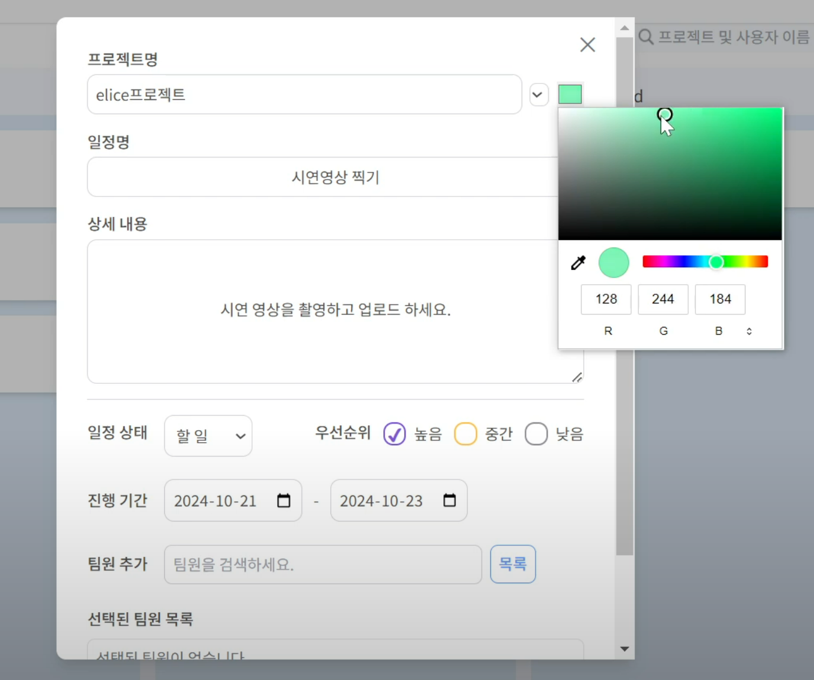
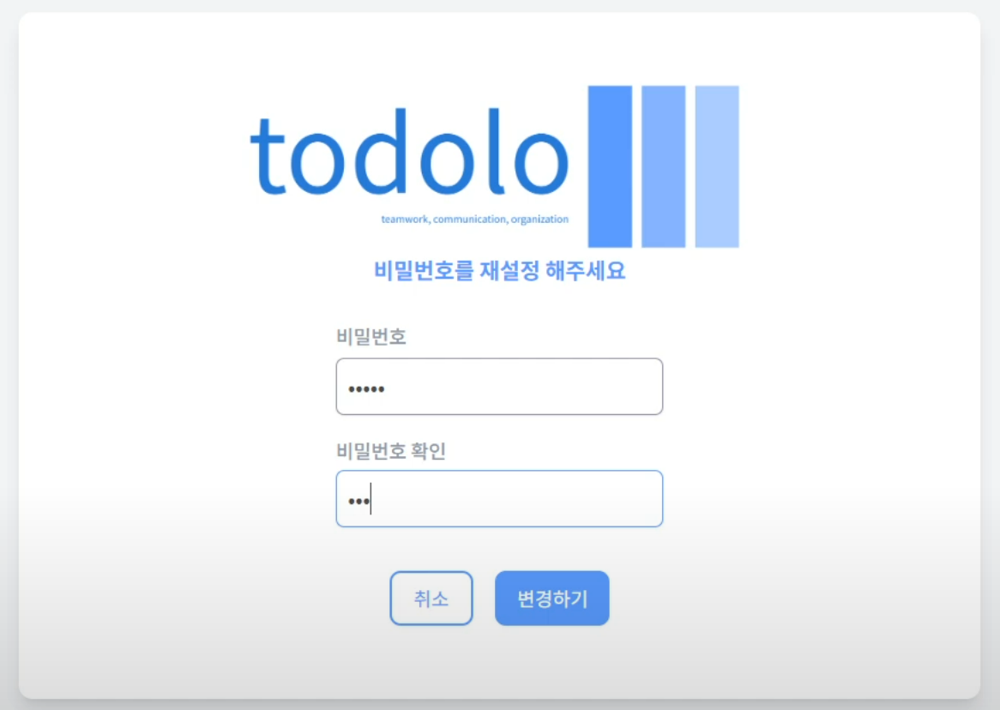
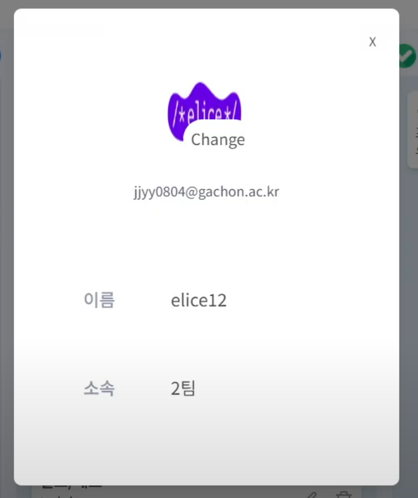

## 🙌 todolo 

  

 

#####   배포 주소 : [http://kdt-react-node-1-team02.elicecoding.com/](http://kdt-react-node-1-team02.elicecoding.com/)   
 
 

## 👥팀원 및 팀 소개

|                               이주영                               |                            조아라                            |                              이서빈                              |                               김영현                                |                               손석경                                |
| :----------------------------------------------------------------: | :----------------------------------------------------------: | :--------------------------------------------------------------: | :-----------------------------------------------------------------: | :-----------------------------------------------------------------: |
|  |  |  |  |  |
|                                 FE                                 |                              FE                              |                                FE                                |                                 BE                                  |                                 BE                                  |
|               [GitHub](https://github.com/jjyy0804)                |        [GitHub](https://kdt-gitlab.elice.io/aj02468)         |          [GitHub](https://kdt-gitlab.elice.io/rylie916)          |               [GitHub](https://github.com/zerohyun00)               |                [GitHub](https://github.com/SonSETO)                 |

 
 

## 🔎프로젝트 소개

- 이 프로젝트는 팀 기반 일정 및 **프로젝트 관리 시스템**입니다. 사용자는 일정을 생성, 수정, 삭제하고 프로젝트 및 팀원을 관리할 수 있습니다. 또한 일정의 상태 및 우선순위를 설정하여 효과적으로 작업을 관리할 수 있습니다.

 
 
  
## 💡주요 기능
### 1. 일정 관리 기능
- 팀과 프로젝트 기반으로 일정을 생성하고 관리할 수 있습니다.
- 일정 항목에는 다음과 같은 정보가 포함됩니다:
  - **프로젝트**: 프로젝트의 제목
  - **제목**: 일정의 제목
  - **내용**: 일정의 상세 설명
  - **상태**: 할 일, 진행 중, 완료 중 하나의 상태로 설정 가능
  - **우선순위**: 높음, 중간, 낮음으로 우선순위 설정
  - **시작 날짜**: 일정 시작일 선택
  - **종료 날짜**: 일정 종료일 선택
  - **팀원**: 업무에 포함되는 팀원 선택

### 2. 팀원 관리 기능
- 일정에 팀원을 추가하거나 제거할 수 있습니다.
  - **팀원 추가**: 서버에서 가져온 팀원 목록에서 팀원을 선택하여 일정에 할당
  - **팀원 제거**: 선택된 팀원 목록에서 팀원을 제거할 수 있음
  - **팀원 정보**: 팀원의 아바타와 이름이 표시됨

### 3. 상태 및 우선순위 관리
- 각 일정에 대해 상태와 우선순위를 설정할 수 있습니다.
  - **상태**: 할 일, 진행 중, 완료로 설정
  - **우선순위**: 높음, 중간, 낮음으로 설정

### 4. 소속 팀 설정
- 가입한 사용자는 이메일을 통해 소속팀을 인증하고 설정할 수 있습니다.

### 5. 일정 서버 동기화
- **서버와의 동기화**:
  - 서버에서 프로젝트 및 일정을 불러오고 클라이언트에서 관리되는 상태와 동기화합니다.
  - 일정 생성, 수정, 삭제 시 서버와 동기화하여 데이터를 유지합니다.

### 6. Zustand를 활용한 상태 관리
- **Zustand**를 사용하여 클라이언트 측에서 상태를 관리합니다.
  - 일정 및 프로젝트 데이터를 로컬 상태에 저장하고 이를 기반으로 추가, 수정, 삭제 작업을 처리합니다.
  - 상태가 자동으로 업데이트되어 사용자의 변경 사항이 실시간으로 반영됩니다.
 
 

## 📺 화면 구성

|                         로그인 페이지                         |                      회원가입 페이지                      |                           메인 페이지                            |
| :-----------------------------------------------------------: | :-------------------------------------------------------: | :--------------------------------------------------------------: |
|               |          |                   |
|                        팀 설정 페이지                         |                       캘린더 페이지                       |                         캘린더 상세 모달                         |
|        |        |  |
|                        일정 추가 모달                         |                      비밀번호 재설정                      |                           내 정보 모달                           |
|  |  |          |

### 🔑사용자 인증
- 회원가입

- 팀 소속 설정

- 비밀번호 재설정

- 정보 변경 (비밀번호)

### 🗓 일정

- 일정 등록

- Drag & Drop 일정 상태 변경 및 수정 삭제

- 댓글 등록, 수정, 삭제

- 일정 검색

- 캘린더뷰

 
 

## 📋작업 및 역할 분담

|        |                                                                     |                                                                                                                      |
| ------ | ------------------------------------------------------------------- | -------------------------------------------------------------------------------------------------------------------- |
| 이주영 |   | <ul><li>일정 등록, 수정, 삭제</li><li>팀 리딩 및 커뮤니케이션</li><li>일정/유저 상태관리</li></ul>                   |
| 조아라 |         | <ul><li>로그인상태유지(프록시설정)</li><li>캘린더/ 랜딩 / 유저정보수정</li><li>비밀번호 재설정요청/ 재설정</li></ul> |
| 이서빈 |     | <ul><li>캘린더 모달, 댓글</li><li>유저정보 모달(소속 팀)</li><li>팀 정하기</li></ul>                                 |
| 김영현 |  | <ul><li>팀</li><li>프로젝트</li><li>업무</li></ul>                                                                   |
| 손석경 |  | <ul><li>유저</li><li>인증</li><li>업무</li></ul>                                                                     |

 
 

## 🛠기술 스택

### Frotend

| 기술 스택       | 설명                                                                 | 로고                                                                                                                        |
| --------------- | -------------------------------------------------------------------- | --------------------------------------------------------------------------------------------------------------------------- |
| **React**       | 사용자 인터페이스 구축을 위한 JavaScript 라이브러리입니다.           |                    |
| **TailwindCSS** | 빠르고 유연한 스타일링을 위한 유틸리티 중심의 CSS 프레임워크입니다.  |  |
| **TypeScript**  | JavaScript에 정적 타입을 추가하여 코드의 안정성을 높이는 언어입니다. |      |
| **Zustand**     | 전역 상태 관리를 위한 간단하고 빠른 상태 관리 라이브러리입니다.      |               |

 

### Backend

| 기술 스택      | 설명                                                                    | 로고                                                                                                                    |
| -------------- | ----------------------------------------------------------------------- | ----------------------------------------------------------------------------------------------------------------------- |
| **Node.js**    | 서버 측 애플리케이션 개발을 위한 JavaScript 런타임입니다.               |         |
| **Express**    | Node.js 위에서 작동하는 빠르고 유연한 웹 애플리케이션 프레임워크입니다. |           |
| **MongoDB**    | 확장성 있고 유연한 데이터 저장을 위한 NoSQL 데이터베이스입니다.         |           |
| **TypeScript** | JavaScript에 정적 타입을 추가하여 코드의 안정성을 높이는 언어입니다.    |  |

 

### Cooperation

| 도구    | 로고                                                                                                         |
| ------- | ------------------------------------------------------------------------------------------------------------ |
| Git     |               |
| GitLab  |      |
| Notion  |  |
| Discord |         |

 

### 인증 및 API 문서화

  
  

 
 

## 🎬 시연 영상

[시연 영상 ](https://youtu.be/KedHE3VGAEc)   
